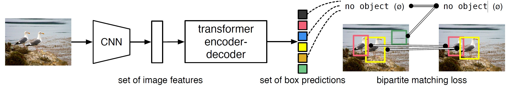

# كشف الكائنات باستخدام المحولات من البداية حتى النهاية [←](../ArabicPaperReviews)

## الخلاصة
تنظر الطريقة الجديدة التي قدّمها الباحثون في هذه الورقة إلى مهمة كشف الكائنات على أنها مسألة <abbr title="يشير إلى قدرة النموذج على استخراج مجموعة الكائنات الموجودة في الصورة دفعة واحدة. وبما أن الناتج يُمثَّل على شكل مجموعة، فإن ذلك يعني ضمنياً أن العنصر الواحد لا يمكن أن يظهر مكرراً داخلها، مما يلغي الحاجة إلى إجراءات لاحقة مثل إزالة التكرارات أو تطبيق خوارزميات الاستبعاد غير الأقصى.">تنبؤ مباشر لمجموعة من الكائنات</abbr>. يساهم هذا المنظور في تبسيط عملية الكشف بشكل كبير، إذ يزيل الحاجة إلى العديد من المكوّنات المُصمَّمة يدوياً، مثل إجراء <abbr title="هو خطوة معالجة لاحقة تُجرى بعد خرج النموذج، وتهدف إلى إزالة المربعات المتكررة التي تتنبأ بوجود نفس الكائن. ويتم ذلك عبر الاحتفاظ بالمربع ذي أعلى درجة ثقة فقط، وحذف المربعات الأخرى التي تتداخل معه بدرجة كبيرة.">الاستبعاد غير الأقصى (NMS)</abbr> أو <abbr title="هو خطوة تُنفَّذ قبل إدخال الصورة إلى النموذج، حيث يتم إنشاء مجموعة من مربعات الكشف ذات مواضع ومقاييس ونِسَب أبعاد مختلفة موزّعة على الصورة. تعتمد كاشفات الكائنات التقليدية على هذه المراسي من أجل التنبؤ بوجود كائن ما داخل منطقة معينة من الصورة، وذلك عبر إسناد الكائنات المتوقعة إلى أقرب المراسي المناسبة من حيث الموقع والحجم.">توليد المربعات المرجعية (anchors)</abbr> الخاصة بالكائنات المراد اكتشافها، وهي مكوّنات كانت تمثل الجزء الأكبر من المعرفة المُسبقة المضمّنة بشكل صريح في أنظمة الكشف التقليدية. يتكون الإطار الرئيسي الجديد، المسمّى <abbr title="محول الكشف Detection Transformer قمت بنحت اسم واحد من أول حرفين من كلمة محول وأخر حرفين من كلمة كشف 'محشف'">محشف</abbr>، من <abbr title="هي دالة تجمع بين المطابقة ثنائية الأطراف ودالتي فاقد التصنيف فاقد إنحدار مربعات الكشف، وتُطبق على مجموعة التنبؤ بأكملها مرة واحدة لضمان تنبؤات فريدة، وعامة، وخالية من التكرار">دالة فاقد عامة قائمة على المجموعة</abbr> تضمن إنتاج تنبؤات فريدة اعتماداً على <abbr title="المطابقة ثنائية الأطراف Bipartite Matchine: هي خوارزمية تهدف إلى إيجاد أفضل توافق بين مربعات التنبؤ الناتجة عن النموذج ومربعات الكائنات الحقيقية في الصورة، وذلك من خلال إنشاء أزواج فريدة تربط كل عنصر متوقَّع بنظيره الحقيقي. وتُستخدم هذه العملية لضمان إزالة أي تكرار في المربعات الناتجة عن النموذج، بحيث يُمثّل كل كائن في الصورة بمربع واحد فقط يعكس التنبؤ الأدق.">المطابقة الثنائية</abbr>، بالإضافة إلى بنية محوّل تعتمد على مُرمِّز وفاك ترميز. وانطلاقاً من مجموعة صغيرة وثابتة من استعلامات الكائنات المُتعلَّمة، يقوم المحشف بتحليل العلاقات البينية بين الكائنات ضمن السياق العام للصورة، ليولّد مباشرة وبالتوازٍي المجموعة النهائية من التنبؤات. يتميّز هذا النموذج ببساطته من الناحية النظرية، إذ لا يحتاج إلى مكتبات متخصصة، على خلاف ما تتطلبه العديد من كاشفات الكائنات الحديثة الأخرى. يُظهر المحشف أداءً عالي الدقة وسرعةً تنافس الأساس المرجعي الذي يقدّمه نموذج Faster R-CNN المُحسّن على مجموعة البيانات الصعبة COCO. علاوة على ذلك، يمكن تعميم نموذج المحشف بسهولة لإنتاج تجزئة شاملة ضمن إطار موحّد. وقد بيّن الباحثون أنه يتفوّق بصورة ملحوظة على خطوط الأساس المنافسة في هذا المجال. يتوفر كود التدريب والنماذج المُدرَّبة على هذا [الرابط](https://github.com/facebookresearch/detr).

## 1. المقدمة
تهدف عملية كشف الكائنات إلى التنبؤ بمجموعة من المربعات التي تُحدّد مواقع الكائنات داخل الصورة، مع إسناد الاسم أو الفئة المناسبة لكل كائن ذي أهمية. وتعالج كاشفات الكائنات الحديثة مهمة التنبؤ بمجموعة كائنات بصورة غير مباشرة، إذ تعتمد على صياغتها كمسائل انحدار وتصنيف بديلة مرتبطة بعدد كبير من المقترحات[^5] [^37] أو المراسي[^23] أو مراكز النوافذ[^46] [^53]. ويتأثر أداء تلك الكاشفات تأثراً كبيراً بخطوات المعالجة اللاحقة الهادفة إلى تقليل التنبؤات شبه المكررة، وبكيفية تصميم المراسي، وبالأساليب الاستدلالية المستخدمة لربط مربعات الكشف المستهدفة بتلك المراسي[^52]. اقترح الباحثون، في محاولة لتبسيط خط العمل، نهج يقوم على التنبؤ المباشر بالمجموعة دون اللجوء إلى المهام البديلة. وقد أفضت هذه الفلسفة العامة إلى تقدم ملحوظ في مهام التنبؤ ذات البنية المعقدة، مثل الترجمة الآلية والتعرّف على الكلام، غير أنها لم تُحدِث أثراً مماثلاً في مجال كشف الكائنات؛ إذ إن المحاولات السابقة[^43] [^16] [^4] [^39] إمّا اعتمدت على إضافة أشكال مختلفة من المعرفة المسبقة، أو لم تتمكّن من إثبات قدرتها التنافسية مقارنة بخطوط الأساس القوية ضمن معايير تقييم صارمة. وتهدف هذه الورقة إلى سد هذه الفجوة. 

الشكل 1: يتنبأ المحشف مباشرة (بالتوازي) بالمجموعة النهائية من عمليات الكشف من خلال دمج شبكة الطي المعروفة من بنية محول. أثناء التدريب، تُعين المطابقة الثنائية التنبؤات بشكل فريد مع مربعات الحقيقة. يجب أن ينتج عن التنبؤ بدون تطابق تنبؤ من فئة "لايوجد"

بسّط الباحثون خط عمل التدريب عبر التعامل مع كشف الكائنات بوصفها مسألة تنبؤ مباشر بالمجموعة. واعتمدوا بنية مُرمِّز–فاك ترميز قائمة على المحوّل[^47]، وهي بنية شائعة في مهام التنبؤ بالسلاسل. إن آليات الإنتباه الذاتي للمحولات، والتي تُنمذج صراحة جميع التفاعلات بين كل عنصرين في سلسلة الدخل، تجعل هذه البنية مناسبة بشكل خاص للقيود المصاحبة للتنبؤ بالمجموعة مثل إزالة التنبؤات المكررة. 

يتنبأ المحشف (إنظر الشكل 1) بجميع الكائنات دفعةً واحدة، ويُدرَّب تدريباً شاملاً اعتماداً على دالة فاقد قائمة على <abbr title="تتضمّن المجموعة بعدين أساسيين في سياق كشف الكائنات: **التعدد**، حيث يقوم النموذج باكتشاف جميع الكائنات دفعةً واحدة ضمن معالجة موحّدة، و**الفرادة**، بمعنى أن النموذج ينتج إطاراً واحداً فقط لكل كائن، دون أي تكرار في التنبؤات.">المجموعة</abbr>، تقوم بإجراء مطابقة ثنائية بين الكائنات المتوقَّعة ونظيراتها الحقيقية. يُبسّط المحشف سير عمل اكتشاف الكائنات عبر الاستغناء عن العديد من المكوّنات المصمَّمة يدوياً في النماذج السابقة، مثل <abbr title="مجموعة مولدة يدوياً من مربعات الكشف ذات المواضع والمقاييس ونسب الأبعاد المختلفة الموزعة على الصورة، للتنبؤ بوجود كائن ما داخل منطقة معينة من الصورة.">المراسي المكانية</abbr>  أو <abbr title="هو خطوة معالجة لاحقة تُجرى بعد خرج النموذج، وتهدف إلى إزالة المربعات المتكررة التي تتنبأ بوجود نفس الكائن. ويتم ذلك عبر الاحتفاظ بالمربع ذي أعلى درجة ثقة فقط، وحذف المربعات الأخرى التي تتداخل معه بدرجة كبيرة.">الاستبعاد غير الأقصى (NMS)</abbr>. لا يحتاج المحشف أي <abbr title="مكونات الشبكة العصبية في التعليم العميق">طبقات</abbr> مخصّصة، بخلاف معظم طرق الكشف السابقة، الأمر الذي يسهّل إعادة تنفيذه في أي إطار عمل يدعم طبقات <abbr title="احدى طبقات شبكات التعليم العميق المشهورة بالكشف عن محتوى الصور">الطي أو الالتفاف</abbr> والمحوّل (اعتمد الباحثون في هذا العمل على الأكواد القياسية <abbr title="هي بنية الشبكة العصبية التي تعتمد على الإنتباه الذاتي والإنتباه العابر بين المشفر وفاك التشفير">للمحوّل</abbr> [^47]، و<abbr title="هي بنية الشبكة ResNet الشهيرة باستخدام اتصالات الباقي بين الطبقات لتحسين التعليم">شبكات البواقي</abbr> [^15] بوصفها العمود الفقري للنموذج، مستفيدين من مكتبات التعلّم العميق الشائعة دون تطوير مكوّنات مخصّصة إضافية).

تتمثل الميزة الرئيسية للمحشف - مقارنة بمعظم الأعمال السابقة في مجال التنبؤ المباشرة بالمجموعة - في اقتران دالة فاقد المجموعة ذات المطابقة الثنائية بالمحول مع أجزاء <abbr title="غير انحداري ذاتي (non-autoregressive): تعني أن جزء فاك التشفير في المحوّل سيتنبأ بجميع الكائنات في المخرجات دفعةً واحدة، بدلاً من التنبؤ بها كائناً تلو الآخر كما يحدث في نماذج اللغة والتي تعتمد على التوليد الانحداري الذاتي.">فك التشفير المتوازي (غير الإنحداري الذاتي)</abbr>[^29] [^12] [^10] [^8]. انصبت الجهود السابقة على استخدام فكّ التشفير الانحداري الذاتي باستخدام الشبكات العصبية المتكررة [^43] [^41] [^30] [^36] [^42]، تأتي دالة فاقد المجموعة ذات المطابقة الثنائية لتعيّن تنبؤاً فريداً لكل كائن حقيقي، دون أن يتأثر هذا التعيين بتبديل ترتيب الكائنات المتوقعة. مايُتيح إنتاج التنبؤات التوازي.

قيّم الباحثون المحشف على مجموعة بيانات <abbr title="COCO - Common Object in Context مجموعة بيانات كبيرة للصور اليومية تستخدم لتقييم نماذج اكتشاف الكائنات، وتجزئة الصور، والتجزئة الشاملة.">الكائنات الشائعة في سياقها</abbr>[^24]، والتي تعد إحدى أشهر مجموعات بيانات كشف الكائنات، وقارنوا النتائج مع نموذج <abbr title="نموذج Faster R-CNN هو كاشف كائنات على مرحلتين: الأولى، تُولد مناطق مقترحة من الصورة عبر شبكة اقتراح المناطق Region Proposal Network. الثانية، تُصنف المناطق المقترحة من الخطوة الأولى، وتحسن حدودها. قارن الباحثون أداء المحشف مع هذا النموذج باعتباره خط أساس لأقوى النماذج المُحسنة لكشف الكائنات.">شبكات الطي المناطقية الأسرع</abbr>[^37] المنافس الأشد. خضع نموذج شبكات الطي المناطقية الأسرع للعديد من التحسينات في التصميم، وتحسن أداؤه بشكل ملحوظ منذ نشره أول مرة. أظهرت تجارب الباحثون أن المحشف يحقق أداءً مقارباً، وللدقة فقد أظهر أداء أفضل بشكل ملحوظ على الأجسام الكبيرة، وهي نتيجة يُرجّح أنها ناتجة عن العمليات الحسابية <abbr title="آلية Non-Local تسمح للنموذج باستخدام معلومات من أي مكان في الصورة (الإنتباه العام)، وليس فقط المناطق القريبة كما في شبكات الطي.">غير المحلية</abbr>  في المُحوّل. حقق النموذج الجديد أداءً أقل على الأجسام الصغيرة. يتوقع الباحثون أن تُحسِن الأعمال المستقبلية هذا الجانب بنفس الطريقة التي حسّنت بها <abbr title="نموذج Feature Pyramid Network (FPN) يدمُج  ميزات شبكات الطي متعددة المقاييس لتحسين دقة الكشف، وخاصة بالنسبة للأجسام الصغيرة.">شبكة الميزات الهرمية</abbr>
[^22] أداء نموذج شبكات الطي المناطقية الأسرع.

تختلف إعدادات تدريب المحشف عن إعدادات كاشفات الأجسام التقليدية في جوانب متعددة. حيث يتطلب النموذج الجديد فترة تدريب طويلة للغاية، ويستفيد من مجموع فواقد وحدة فك التشفير الإضافية في المحول. يستكشف الباحثون بدقة المكونات الأساسية التي للأداء الذي تتحدث هذه الورقة عنه.

يمكن تطبيق الفلسفة المتبعة لتصميم المحشف بسهولة على مهام أكثر تعقيدًا. بيّن الباحثون في تجاربهم أن رأس تجزئة بسيط مُدرب على محشف مُدرب مسبقًا يتفوق على النماذج الأساسية المنافسة في <abbr title="Panoptic Segmentation أحد مجالات الرؤية الحاسوبية التي تجمع بين: تجزئة الكائنات، الأشياء القابلة للعد في الصورة مثل الأشخاص، أو السيارات. والتجزئة الدلالية، المناطق غير القابلة للعد مثل السماء، أو الطريق أو العشب.">التجزئة الشاملة</abbr>[^19]، وهي مهمة صعبة اكتسبت شعبية مؤخراً للتعرف على كل بكسل.

## 2. الأعمال ذات الصلة
تستند هذه الورقة على مجموعة من الأعمال السابقة في عدة مجالات: فاقد المطابقة الثنائية للتنبؤ بالمجموعات، وهياكل التشفير وفك التشفير القائمة على المحول، وفك التشفير المتوازي، وطرق الكشف عن الكائنات.

### 2.1 التنبؤ بمجموعة
لا يوجد نموذج تعلم عميق معياري للتنبؤ بمجموعة مباشرة. تتمثل مهمة التنبؤ الأساسية بمجموعة في تصنيف متعدد التصنيفات (انظر على سبيل المثال [^33] [^40] للاطلاع على مراجع في سياق الرؤية الحاسوبية)، حيث لا ينطبق النهج الأساسي،

### 2.2 المحولات وفك التشفير المتوازي

### 2.3 كشف الكائنات

## المراجع
[^4]: Bodla, N., Singh, B., Chellappa, R., Davis, L.S.: Soft-NMS improving object detection with one line of code. In: ICCV (2017)
[^5]: Cai, Z., Vasconcelos, N.: Cascade R-CNN: High quality object detection and instance segmentation. PAMI (2019)
[^8]: Devlin, J., Chang, M.W., Lee, K., Toutanova, K.: BERT: Pre-training of deep bidirectional transformers for language understanding. In: NAACL-HLT (2019)
[^10]: Ghazvininejad, M., Levy, O., Liu, Y., Zettlemoyer, L.: Mask-predict: Parallel decoding of conditional masked language models. arXiv:1904.09324 (2019)
[^12]: Gu, J., Bradbury, J., Xiong, C., Li, V.O., Socher, R.: Non-autoregressive neural machine translation. In: ICLR (2018)
[^15]: He, K., Zhang, X., Ren, S., Sun, J.: Deep residual learning for image recognition. In: CVPR (2016)
[^16]: Hosang, J.H., Benenson, R., Schiele, B.: Learning non-maximum suppression. In: CVPR (2017)
[^19]: Kirillov, A., He, K., Girshick, R., Rother, C., Dollar, P.: Panoptic segmentation. In: CVPR (2019)
[^22]: Lin, T.Y., Dollar, P., Girshick, R., He, K., Hariharan, B., Belongie, S.: Feature pyramid networks for object detection. In: CVPR (2017)
[^23]: Lin, T.Y., Goyal, P., Girshick, R.B., He, K., Dollar, P.: Focal loss for dense object detection. In: ICCV (2017)
[^24]: Lin, T.Y., Maire, M., Belongie, S., Hays, J., Perona, P., Ramanan, D., Dollar, P., Zitnick, C.L.: Microsoft COCO: Common objects in context. In: ECCV (2014)
[^29]: Oord, A.v.d., Li, Y., Babuschkin, I., Simonyan, K., Vinyals, O., Kavukcuoglu, K., Driessche, G.v.d., Lockhart, E., Cobo, L.C., Stimberg, F., et al.: Parallel wavenet: Fast high-fidelity speech synthesis. arXiv:1711.10433 (2017)
[^30]: Park, E., Berg, A.C.: Learning to decompose for object detection and instance segmentation. arXiv:1511.06449 (2015)
[^33]: Pineda, L., Salvador, A., Drozdzal, M., Romero, A.: Elucidating image-to-set prediction: An analysis of models, losses and datasets. arXiv:1904.05709 (2019)
[^36]: Ren, M., Zemel, R.S.: End-to-end instance segmentation with recurrent attention. In: CVPR (2017)
[^37]: Ren, S., He, K., Girshick, R.B., Sun, J.: Faster R-CNN: Towards real-time object detection with region proposal networks. PAMI (2015)
[^39]: Rezato ghi, S.H., Kaskman, R., Motlagh, F.T., Shi, Q., Cremers, D., Leal-Taixe, L., Reid, I.: Deep perm-set net: Learn to predict sets with unknown permutation and cardinality using deep neural networks. arXiv:1805.00613 (2018)
[^40]: Rezato ghi, S.H., Milan, A., Abbasnejad, E., Dick, A., Reid, I., Kaskman, R., Cremers, D., Leal-Taix, l.: Deepsetnet: Predicting sets with deep neural networks. In: ICCV (2017)
[^41]: Romera-Paredes, B., Torr, P.H.S.: Recurrent instance segmentation. In: ECCV (2015)
[^42]: Salvador, A., Bellver, M., Baradad, M., Marques, F., Torres, J., Giro, X.: Recurrent neural networks for semantic instance segmentation. arXiv:1712.00617 (2017)
[^43]: Stewart, R.J., Andriluka, M., Ng, A.Y.: End-to-end people detection in crowded scenes. In: CVPR (2015)
[^46]: Tian, Z., Shen, C., Chen, H., He, T.: FCOS: Fully convolutional one-stage object detection. In: ICCV (2019)
[^47]: Vaswani, A., Shazeer, N., Parmar, N., Uszkoreit, J., Jones, L., Gomez, A.N., Kaiser, L., Polosukhin, I.: Attention is all you need. In: NeurIPS (2017)
[^52]: Zhang, S., Chi, C., Yao, Y., Lei, Z., Li, S.Z.: Bridging the gap between anchor-based and anchor-free detection via adaptive training sample selection. arXiv:1912.02424 (2019)
[^53]: Zhou, X., Wang, D., Krahenbuhl, P.: Objects as points. arXiv:1904.07850 (2019) Carion et al.
